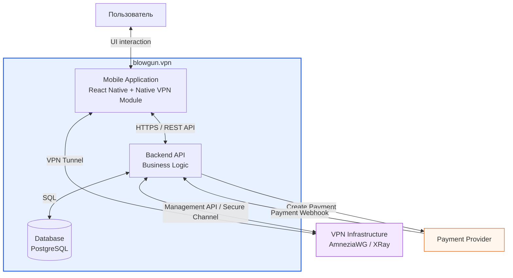

# Container Diagram — blowgun.vpn

```mermaid
flowchart TB
    User["Пользователь"]

    subgraph Blowgun["blowgun.vpn"]
        App["Mobile Application<br/>React Native + Native VPN Module"]
        Backend["Backend API<br/>Business Logic"]
        DB[("Database<br/>PostgreSQL")]
    end

    VPN["VPN Infrastructure<br/>AmneziaWG / XRay"]
    Payment["Payment Provider"]

    User <-->|UI interaction| App
    App <-->|HTTPS / REST API| Backend
    Backend <-->|SQL| DB
    Backend <-->|Management API / Secure Channel| VPN
    App <-->|VPN Tunnel| VPN
    Backend -->|Create Payment| Payment
    Payment -->|Payment Webhook| Backend

    style Blowgun fill:#e8f1ff,stroke:#2563eb,stroke-width:2px
    style VPN fill:#f3e8ff,stroke:#9333ea
    style Payment fill:#fff7ed,stroke:#ea580c
```
